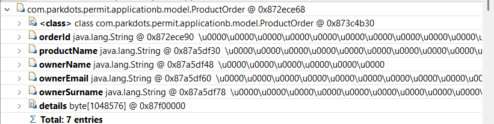
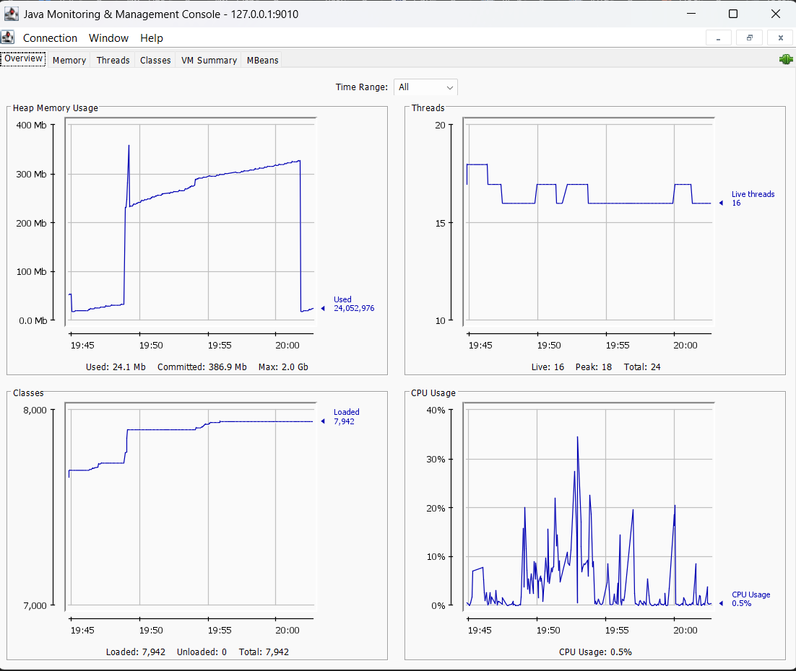

# Heap Dump Sanitization Demo

This repository contains a Docker Compose setup with two intentionally unstable Spring Boot applications and a sanitization service. The apps are designed to trigger `OutOfMemoryError` events that write heap dumps to a shared volume. The sanitization service picks up those dumps and removes sensitive data using PayPal's `heap-dump-tool` so they can be safely inspected.

## Architecture
- **Application A (`app-a`)** — Simulates session growth by endlessly allocating 1 MB payloads when `/api/oom` is called, leading to an `OutOfMemoryError`. The resulting heap dump is written to `/heap/input` via `JAVA_TOOL_OPTIONS` and the `HeapDumpPath` JVM argument.
- **Application B (`app-b`)** — Simulates order data growth with a similar OOM endpoint. It also writes heap dumps to the shared input volume. 
- **Heap Dump Sanitizer (`heap-sanitizer`)** — An Apache Camel route watches the input directory for `.hprof` files, invokes `heap-dump-tool sanitize <input> <output>`, and stores sanitized copies in the output directory. 
- **Shared volume** — Docker Compose mounts `heap-dumps` to `/heap/input` for all services and maps the sanitizer's output to a host directory for easy retrieval. 

## Prerequisites
- Docker and Docker Compose
- (Optional) A host directory for sanitized dumps; update the `heap-dumps` volume mapping in `docker-compose.yml` if you are not on Windows.

## Running the demo
1. Build and start all services:
   ```bash
   docker compose up --build
   ```
2. Trigger OOM in Application A or B to generate a heap dump:
   ```bash
   # Application A (exposed on port 8081)
   curl http://localhost:8081/api/oom

   # Application B (exposed on port 8082)
   curl http://localhost:8082/api/oom
   ```
   Each request enters an infinite allocation loop; the container will eventually crash with an OOM and write a `.hprof` file to `/heap/input`.
3. Watch the sanitizer logs in the Compose output. Camel detects the new file, runs `heap-dump-tool sanitize`, and writes the sanitized dump to the configured output directory (default `C:/heap-dumps/output` on the host). 【F:HeapDumpSanitizer/src/main/resources/application.properties†L4-L8】【F:HeapDumpSanitizer/Dockerfile†L15-L22】

## Configuration
Key environment variables in `docker-compose.yml` control the demo:
- `JAVA_TOOL_OPTIONS=-XX:+HeapDumpOnOutOfMemoryError` — Enables automatic heap dump creation for the application containers.
- `SANITIZER_INPUT_DIR`, `SANITIZER_OUTPUT_DIR`, `SANITIZER_SCAN_INTERVAL_MS` — Configure the sanitizer's watch and write locations plus poll interval.
- `sanitizer.heap-dump-tool-path`, `sanitizer.input-dir`, `sanitizer.output-dir` — Spring Boot properties that can be overridden to point to different locations or tool versions.

## Cleanup
Stop the stack and remove containers/volumes when finished:
```bash
docker compose down -v
```

## Result (sanitized)



## Result Jconsole (sanitized)

